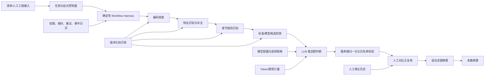

# QMind 智能体 Agent 系统与 Harness 工程盘点

> 盘点日期：2026-08-29  
> 盘点范围：当前代码、数据库结构、活动知识库版本、近期运行数据及自动化测试

## 一、结论摘要

截至 2026-08-29，QMind 可以定义为：

> 面向工程造价的生产级受控 Agent 系统，以确定性 Workflow Harness 为执行内核。

它已经具备较完整的 Agent Runtime Harness，但仍不是通用型自主 Agent 平台。更准确的技术分类是：

> Vertical Agentic Workflow + Domain Knowledge Harness + Human-in-the-loop

OpenAI 对 Agent 的严格定义强调：模型应管理工作流，并根据状态动态选择工具。只是在固定流程节点调用模型的应用，更接近 Agentic Workflow。参考：[OpenAI：A practical guide to building agents](https://openai.com/business/guides-and-resources/a-practical-guide-to-building-ai-agents/)。

Anthropic 对 Agent Harness 的定义更宽：负责处理输入、调度模型和工具、保存运行状态并返回结果的系统，都属于 Agent Harness。参考：[Anthropic：Managed Agents](https://www.anthropic.com/engineering/managed-agents)。

据此判断：

| 概念 | QMind 当前符合度 |
|---|---:|
| 领域 AI 应用 | 5/5 |
| Agentic Workflow | 5/5 |
| Agent Runtime Harness | 4.5/5 |
| 受控领域 Agent | 4/5 |
| 自主规划 Agent | 2/5 |
| 通用 Agent 平台 | 1.5/5 |
| 多 Agent 系统 | 1/5 |

QMind 的模型已经能够判断、检索、匹配和调用结构化工具，但“下一步做什么”仍由后端状态机决定，而不是模型自主决定。因此它是受控 Agent，而非开放式自主 Agent。

## 二、当前系统架构



当前主要实现位置：

- 主工作流：`api/routers/pricing_task.py::_stream_pricing_item`
- 新版单条流程：`api/routers/pricing_task_v2.py::_stream_pricing_item_v2`
- 后台批量工作器：`api/routers/pricing_task.py::_run_background_item`
- 模型配置：`api/services/model_profiles.py`
- Token 与费用计量：`api/services/ai_usage.py`
- 知识库导入治理：`api/services/pricing_kb_import_admin.py`

## 三、本轮迭代带来的主要升级

### 3.1 后台批量执行 Harness

后台批量已经不再是前端循环调用接口，而是独立的任务执行系统，具备：

- 批次执行实例；
- 清单项级运行状态；
- 数据库任务租约；
- 并发上限；
- 工作线程调度；
- 失败重试和延迟重试；
- 模型限流错误单独处理；
- 停止请求；
- 超时任务回收；
- 运行事件记录；
- 连接池资源预留；
- 模型调用期间释放数据库连接。

这意味着系统已经拥有比较完整的长任务 Harness，而不再只是同步 AI 接口。

### 3.2 可固定、可回滚的推理管线

后台执行会固化管线版本：

```text
pipeline_version = legacy | combined_v2
```

运行创建后，所用管线版本不会受后续配置变化影响。盘点时数据库中的执行情况为：

| 管线 | 状态 | 执行数 |
|---|---|---:|
| `combined_v2` | completed | 3 |
| `legacy` | completed | 23 |
| `legacy` | stopped | 2 |

`combined_v2` 已经完成过真实运行，但样本量仍然较小，当前更适合作为灰度管线，而不是直接替换全部旧流程。

### 3.3 新版第五步合并模型判断

新版将原来第五步中分离的“分析”和“结构化提交”合并为一次强制工具调用：

- 模型在一次上下文中完成候选比较；
- 必须调用指定工具；
- 不允许提交候选外定额；
- 推理文本与工具参数分离；
- 保留原始推理展示；
- 流式失败后进入非流式降级；
- 最多三次调用尝试。

这样可以减少重复上下文、模型调用次数和前后两次判断不一致的问题。

### 3.4 工程量系数约束得到部分修复

新版 `_normalize_matches_v2()` 已经强制要求工程量系数：

- 必须是数值；
- 必须为有限值；
- 必须大于零；
- 无效时回退为 `1.0`；
- 同时增加人工复核问题。

但旧版 `_normalize_matches()` 仍主要进行 `float()` 转换，没有统一校验 `NaN`、`Infinity` 和小于等于零的数值。因此该风险尚未在所有管线彻底关闭。

### 3.5 用户级模型配置

系统新增了：

- 用户独立模型配置；
- API Key 加密存储；
- DeepSeek、智谱及自定义 OpenAI-compatible 地址；
- 用户默认模型；
- 模型连通性测试；
- 输入、缓存输入和输出单价配置；
- 防止不同用户凭据通过全局客户端缓存泄漏。

这使模型供应商可移植性明显提升。不过部分推理参数仍带有模型特定特征，还没有完全形成供应商无关适配层。

### 3.6 Token 与费用可观测性

系统现在能够记录：

- 用户和模型配置；
- Provider 和模型名称；
- 业务类型和操作名称；
- 输入 Token；
- 缓存输入 Token；
- 输出 Token；
- 推理 Token；
- 总 Token；
- 费用；
- 请求状态和错误类型；
- 任务、批次、清单运行关联。

盘点时数据库中的实际数据为：

- 调用计量记录：8,584 条；
- 累计 Token：49,815,082；
- 累计成本：约 154.91 元。

说明这部分不是预留表结构，而是已经进入实际运行链路。

## 四、知识库 Harness 盘点

### 4.1 当前活动版本

当前活动知识发布版本为 Version 21。

| 知识表 | 当前行数 | 用途 |
|---|---:|---|
| `TLibs` | 15 | 专业定额库 |
| `TQDK_TZJMC` | 610 | 清单章节与章节规则 |
| `TQDK_TQDZM` | 4,372 | 清单编码与名称 |
| `TQDK_TQDXMTZ` | 15,935 | 项目特征结构和默认值 |
| `TQDK_TQDZY` | 26,737 | 标准清单—定额候选 |
| `TQDK_TQDZY_SPECIAL` | 42 | 典型计价候选及分组 |
| `TDEK_TZJMC` | 5,590 | 定额章节 |
| `TDEK_TDEZM` | 32,997 | 定额子目 |
| `TDEK_TZMGC` | 332,382 | 定额组成 |
| `TDEK_TZHHS` | 1,525 | 换算规则 |
| `TDEK_TZNHS` | 66,351 | 含量及系数知识 |

### 4.2 表级数据版本治理

知识版本已经从简单的整库版本，演进为发布版本到表级数据版本的映射：

```text
release version
    ├── TQDK_TQDZM -> data_version_id
    ├── TQDK_TQDXMTZ -> data_version_id
    ├── TQDK_TQDZY -> data_version_id
    └── TDEK_* -> data_version_id
```

数据库函数 `pricing_kb_data_version()` 负责解析某个发布版本实际使用的表数据版本。

同时已经具备：

- SQLite 源库结构契约；
- 列名、类型和可空性检查；
- 缺列和意外列报告；
- 布尔值严格转换；
- 外键孤儿数据检查；
- 导入完成后的有效版本校验；
- 数据库迁移登记；
- 重复上传恢复。

知识库部分已经接近正式的数据发布系统，而不再只是一个导入脚本。

### 4.3 仍存在的复现风险

当任务绑定版本中不存在特征表数据时，特征上下文加载仍可能回退到当前活动版本。

这会产生以下情况：

> 历史任务绑定旧知识版本，但特征分析实际读取了后来发布的活动版本。

建议禁止隐式回退；如果为了兼容历史数据必须回退，至少应在 Run 中保存真实使用的 `schema_kb_version_id`。

## 五、Harness 约束体系

| 层级 | 已有约束 |
|---|---|
| 指令层 | 固定系统提示词、分阶段任务说明、禁止发明规则 |
| 工具层 | 强制工具选择、JSON Schema、候选 ID 白名单 |
| 知识层 | 发布版本、表级数据版本、结构契约、导入校验 |
| 输出层 | 枚举归一化、候选去重、非法 ID 过滤 |
| 流程层 | 固定步骤、状态机、管线版本固化 |
| 执行层 | 重试、限流识别、租约、超时恢复、连接池让渡 |
| 权限层 | 登录、角色、数据所有权、管理员边界 |
| 人工层 | 人工对比、确认、修正历史、操作人审计 |
| 观测层 | 步骤耗时、推理文本、事件日志、Token 和费用 |
| 回滚层 | `legacy/combined_v2` 配置切换，新执行固化版本 |

## 六、当前仍不属于完整自主 Agent 的部分

当前模型依然不能：

- 自主决定下一步骤；
- 在多个工具中动态选择；
- 自主添加或删除流程节点；
- 自主判断整个任务何时结束；
- 根据失败重新制定计划；
- 创建子任务或交给其他 Agent；
- 使用长期记忆；
- 在沙箱中执行开放式操作。

当前工具调用本质上仍以“结构化决策提交”为主，而不是开放的“感知—行动—观察—再规划”循环。

工程造价属于高风险业务，继续保留受控模式是合理的。增加自主性本身并不等于提升产品质量。

## 七、主要缺口与建设优先级

### 7.1 P0：影响结果可信度

1. 章节规则 `failed/manual_review` 尚未成为统一的确认门禁。
2. 旧管线没有统一验证工程量系数为有限正数。
3. Run 没有完整固化提示词版本或提示词哈希。
4. 没有保存候选集合哈希和关键输入快照。
5. 特征知识仍存在跨版本隐式回退。

### 7.2 P1：影响 Harness 工程成熟度

1. 缺少独立的离线 Evaluation Harness。
2. 没有版本化黄金样本、重复试验和发布阈值。
3. 现有测试主要验证代码和规则，没有批量评估业务最终结果。
4. 缺少统一的 Trace、Span 和 Transcript 数据模型。
5. Token 和费用已有统计，但没有任务预算、超额中止和费用告警。
6. `combined_v2` 真实完成样本只有 3 次，暂不足以证明优于旧管线。

Anthropic 将 Evaluation Harness 定义为能够运行任务、记录完整轨迹、执行评分并汇总结果的基础设施。QMind 当前有业务评估和单元测试，但还没有形成这一完整层次。参考：[Anthropic：Demystifying evals for AI agents](https://www.anthropic.com/engineering/demystifying-evals-for-ai-agents)。

### 7.3 P2：影响长期维护

- 将超过 7,000 行的 `pricing_task.py` 拆分为流程编排、工具、知识检索、模型调用、批次执行、换算服务和评测模块；
- 建立正式 Tool Registry；
- 为候选增加排序、截断和上下文预算；
- 对清单文本增加 Prompt Injection 边界处理；
- 建立 Provider Adapter，隔离供应商专用推理参数；
- 谨慎控制推理文本保存和展示，避免敏感信息长期留存。

## 八、成熟度评分

| 能力 | 上次 | 当前 |
|---|---:|---:|
| 领域知识工程 | 4.5 | 4.7 |
| 确定性工作流 | 4.5 | 4.7 |
| 工具及输出约束 | 4.5 | 4.6 |
| 知识版本治理 | 4.5 | 4.8 |
| 后台长任务执行 | 2.5 | 4.5 |
| 模型配置与隔离 | 2.0 | 4.0 |
| Token/费用观测 | 1.5 | 4.2 |
| 人工反馈审计 | 4.5 | 4.5 |
| 运行可靠性 | 4.0 | 4.6 |
| 自动化评测 | 3.5 | 3.6 |
| Agent 自主规划 | 2.0 | 2.0 |
| 通用 Harness 能力 | 2.0 | 2.8 |

## 九、测试验证

盘点期间共收集 71 项测试：

- 67 项验证通过；
- 4 项因当前沙箱无法访问 pytest 临时目录而未完成；
- 没有发现对应的业务断言失败。

4 项未完成测试均依赖 pytest 的 `tmp_path`，错误为 Windows 临时目录访问权限不足，不应直接判断为产品功能回归。

## 十、最终定位建议

推荐正式定义：

> QMind 是一个工程造价领域的受控 AI Agent 系统。系统以确定性 Workflow Harness 为核心，通过版本化领域知识、结构化模型工具、规则校验、后台任务调度、人工复核和成本观测，完成可追踪、可回滚、可审计的智能组价。

推荐技术文档标题：

> QMind 工程造价 Agent Runtime 与 Harness 工程架构

暂不建议使用以下定位：

- 通用智能体平台；
- 自主决策 Agent；
- 多智能体系统；
- 通用 Agent 操作系统。

## 十一、建议下一阶段验收目标

建议将下一阶段 Harness 建设定义为以下可验收目标：

1. 所有运行均固化 `pipeline_version`、模型、提示词哈希、真实知识数据版本和候选集合哈希。
2. 章节规则失败能够阻断确认，管理员覆盖必须填写原因并留下审计记录。
3. 所有新旧管线统一执行工程量系数有限正数校验。
4. 建立不少于 100 个专家标注清单项的版本化黄金样本集。
5. 新模型、新提示词和新管线必须通过离线评测阈值才能发布。
6. 建立以任务为单位的 Token、成本、耗时和错误率预算。
7. 对 `combined_v2` 与 `legacy` 进行同样本、多次试验的准确率、成本和耗时对比。

完成以上目标后，QMind 的定位可以进一步升级为：

> 具备完整运行 Harness、评测 Harness 和发布治理体系的工程造价领域 Agent 产品。
